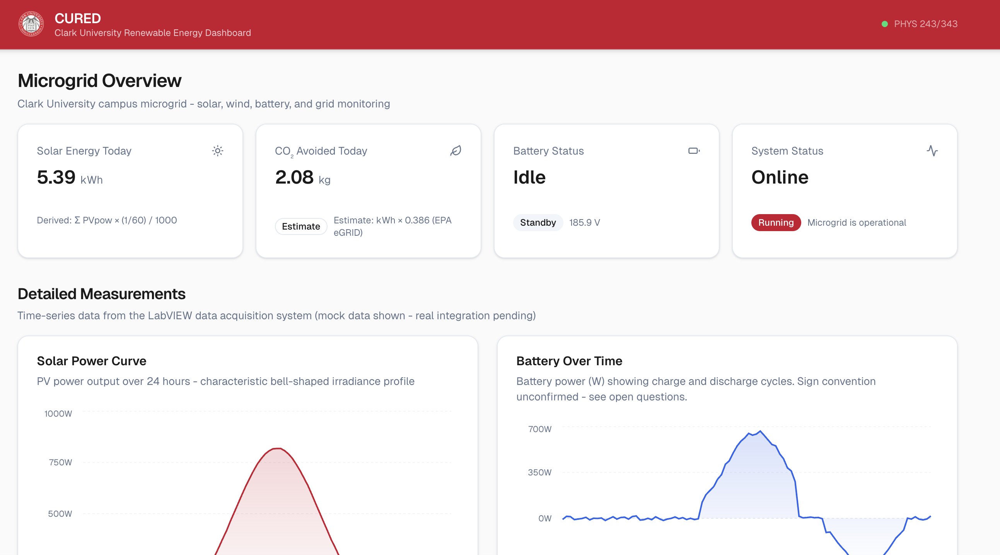

# CURED - Clark University Renewable Energy Dashboard

**CURED** is a web-based dashboard for monitoring Clark University's on-campus microgrid system. It visualizes data from solar panels, wind turbines, and a battery storage system installed on the Clark University campus in Worcester, MA.

This project is developed as part of **PHYS 243/343: Technology of Renewable Energy**, under Professor Agosta.



---

## Overview

Clark University operates a microgrid that includes photovoltaic (PV) solar panels, a horizontal axis wind turbine (HAWT), a vertical axis wind turbine (VAWT), a battery storage system, and a connection to the AC utility grid. All of these systems are monitored by a LabVIEW data acquisition application running continuously in the physics lab. The system records 27 physical measurements every 60 seconds, 24 hours a day.

CURED reads that data and presents it in a way that is useful for two audiences: the general Clark University community (students, faculty, and visitors who want to understand what the microgrid is doing) and the academic audience (physics and engineering students who want to see the raw measurements and understand the underlying physics).

This project builds on earlier work by Megan McIntyre (Physics, Class of 2019), who developed the first web-based monitoring interface for this system.

---

## Features

### For everyone
- Solar energy produced today, displayed in kilowatt-hours (kWh)
- CO₂ emissions avoided, computed from solar generation using the EPA average US grid emissions factor (0.386 kg CO₂ per kWh)
- Battery status - whether the system is currently charging, discharging, or idle
- System status indicator - is the microgrid currently running?

### For the academic community
- Solar power curve: a time-series chart of PV power output over 24 hours, showing the characteristic bell-shaped irradiance profile
- Battery power over time, revealing charge and discharge cycles
- HAWT vs. VAWT RMS voltage comparison: two fundamentally different wind turbine architectures shown side by side
- AC grid power flow: whether the microgrid is importing from or exporting to the utility grid
- Wind speed over time (MPH), measured by a dedicated anemometer on the Raspberry Pi subsystem

---

## Technology Stack

| Layer | Technology | Reason |
|---|---|---|
| Framework | [Next.js](https://nextjs.org/) 16 (App Router) | Modern React framework, server and client rendering |
| Language | TypeScript | Type safety reduces bugs in data handling |
| Styling | Tailwind CSS v4 | Efficient, consistent, utility-first styling |
| UI Components | [shadcn/ui](https://ui.shadcn.com/) | Consistent design system with cards, badges, and chart components |
| Charts | shadcn/ui charts (Recharts) | Themed charting integrated with the design system |
| Package manager | npm | Standard |

---

## Project Structure

```
cured/
├── src/
│   ├── app/
│   │   ├── layout.tsx          # Root layout with Clark University header
│   │   ├── page.tsx            # Main dashboard page
│   │   └── globals.css         # Global styles with Clark color theme
│   ├── components/
│   │   ├── dashboard/
│   │   │   ├── public-metrics.tsx      # kWh, CO₂, battery status, system status
│   │   │   ├── metric-card.tsx         # Reusable summary card component
│   │   │   ├── solar-power-chart.tsx   # PVpow time-series over 24h
│   │   │   ├── battery-chart.tsx       # BattPow over time
│   │   │   ├── wind-turbine-chart.tsx  # HAWTrms vs VAWTrms comparison
│   │   │   ├── ac-grid-chart.tsx       # acPower over time
│   │   │   └── anemometer-chart.tsx    # Wind speed in MPH over time
│   │   └── ui/                         # shadcn/ui primitives (card, badge, chart)
│   └── lib/
│       ├── mock-data.ts        # Mock data generator with representative values
│       ├── types.ts            # TypeScript types and constants
│       └── utils.ts            # Utility functions (cn)
├── data/
│   └── Crv005.txt              # Sample real data file (Day 005)
├── CLAUDE.md                   # AI assistant context file
└── README.md                   # This file
```

---

## Getting Started

### Prerequisites

- Node.js 18.17 or later
- npm 9 or later

### Installation

```bash
git clone https://github.com/[your-username]/cured.git
cd cured

npm install

npm run dev
```

Open [http://localhost:3000](http://localhost:3000) in your browser.

### Build for production

```bash
npm run build
npm start
```

---

## Development Status

| Feature | Status |
|---|---|
| Next.js project setup | Done |
| Clark University visual identity | Done |
| Dashboard layout | Done |
| Public metrics panel (kWh, CO₂, battery, system) | Done |
| Solar power chart | Done |
| Battery chart | Done |
| Wind turbine comparison chart | Done |
| AC grid chart | Done |
| Wind speed chart | Done |
| PowCrv file parser | Planned |
| Real data integration | Planned |
| Backend API routes | Planned |

---

## Academic Notes

### CO₂ calculation

The CO₂ avoided metric is computed as:

> CO₂ avoided (kg) = Solar energy (kWh) × 0.386

The factor 0.386 kg CO₂/kWh is the EPA eGRID average US electricity emissions factor. This is an approximation - the actual avoided emissions depend on the current fuel mix of the local grid (ISO-NE for Worcester, MA). This metric is labeled as an estimate in the dashboard.

**Source:** U.S. Environmental Protection Agency (EPA), eGRID Summary Tables.

### Noise thresholding

At night, several sensor columns produce small non-zero readings due to electronic noise in the DAQ hardware. For example, `PVvolts` reads approximately -0.35V at midnight when the solar panel is not generating any power. A noise threshold is applied during data processing: values below a physically meaningful minimum are treated as zero. This is standard practice in data acquisition systems.

### Sign conventions

The sign conventions for `acPower` and `BattCurr` (whether positive means import or export, charging or discharging) have not been formally confirmed at the time of writing. These metrics are displayed with a note in the UI until the convention is verified with Professor Agosta.

---

## Acknowledgments

- **Professor Agosta** - PHYS 243/343, Clark University
- Clark University Physics Department for access to the microgrid infrastructure

---

## License

This project is developed for academic purposes at Clark University. Contact the Physics Department for questions about reuse or adaptation.
